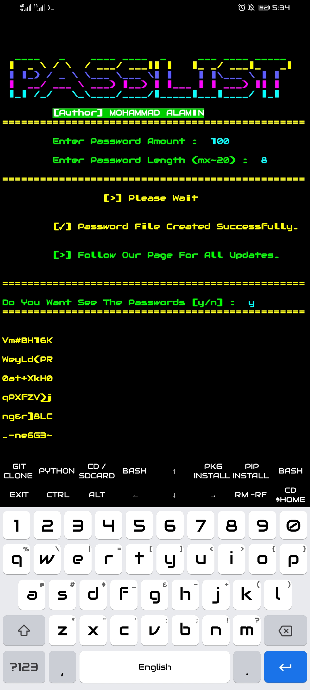

<h1 align="center">
☆ᴍᴏʜᴀᴍᴍᴀᴅ ᴀʟᴀᴍɪɴ☆
</h1>

<h2 align="center">
☆All in '1'☆
</h2>

 

 

 

 

<h2 align="center">☆[INFORMATION]☆</h2>

* RANDOM PASSWORD MAKING FOR TERMUX  Thanks For Using. 

<h3 align="center">☆[INSTALL]☆</h3>

*`
pkg update && upgrade -y
`
*`
pkg install git -y
`
*`
git clone https://github.com/AK27X/pwd
`
*`
pkg install python -y
`

<h5 align="center">☆[RUN]☆<h5>
*`
cd pwd
`
*`
python password
`

  

<h4 align="center">☆[UNINSTALL]☆<h4>

*`
rm -rf pws
`
* USERNAME : AK27X
* PASSWORD : DARKCYBER

<h6 align="center">
☆CONTACT☆
</h5>

